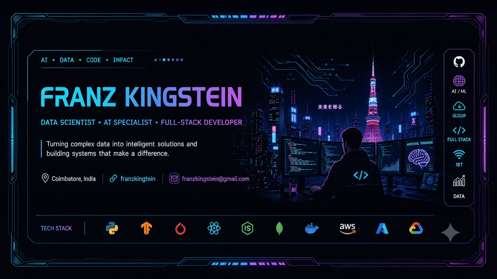

# Glories to GOD 

  

  

# 💫 About Me:

### Hello world!
 

This is **Franz Kingstein N** featuring as:

  

* 🔭 I’m currently working on **AI Agents, Generative AI applications, and scalable full-stack solutions**
* 👯 I’m looking to collaborate on **innovative AI, Computer Vision, and GenAI projects that solve real-world problems**
* 🤝 I’m looking for help with **advanced MLOps, distributed AI systems, and research in Generative AI**
* 🌱 I’m currently learning **Diffusion Models and advanced Multi-Agent Systems**
* 💬 Ask me about **Machine Learning, Artificial Intelligence, Full-Stack Development, Data Science, Computer Vision, and MLOps**
* ⚡ Fun fact: **I've built projects spanning AI, IoT, Full-Stack, Automation, and Cloud — from autonomous drones to enterprise banking systems!**

 

  

# 💻 Tech Stack:

### 🚀 Languages & Core
 
 
 
 
 
 

### 🧠 AI / ML & Frameworks
 

 
 

### 🌐 Web & Mobile Development
 
 
 
 
 
 
 
 
 
 
 

### 🌁 Cloud & DevOps
 
 
 
 
 
 
 
 
 
 
 

### 🗄️ Databases & Analytics
 
 
 
 
 

### 🛠️ Hardware, IoT & Tools
 
 
 
 
 
 

### 🎨 Design & Prototyping
 
 
 
 

  

# 📊 GitHub Stats:

 
 

  

## 🌐 Socials:

 
 
 

  

### ✍️ Random Dev Quote

  

---

<!-- Proudly created with GPRM ( https://gprm.itsvg.in ) -->
